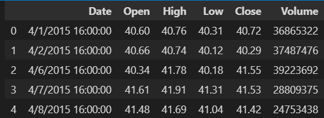
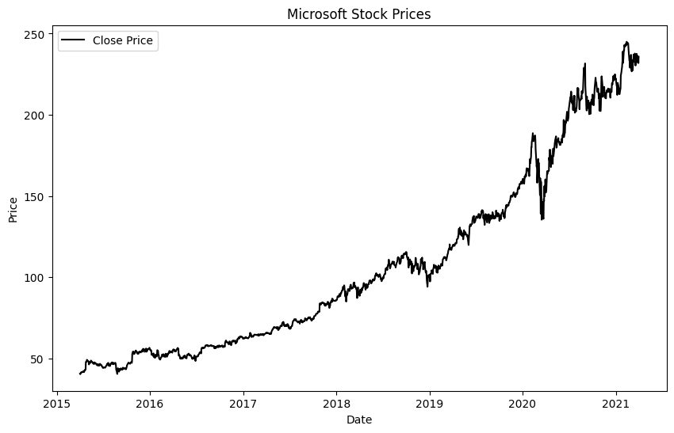

# Ex.No: 01 PLOT A TIME SERIES DATA
###  Date: 

# AIM:
To Develop a python program to Plot a time series data (population/ market price of a commodity
/temperature.
# ALGORITHM:
1. Import the required packages like pandas and matplot
2. Read the dataset using the pandas
3. Calculate the mean for the respective column.
4. Plot the data according to need and can be altered monthly, or yearly.
5. Display the graph.
# PROGRAM:
## Register Number : 212222240119
## Name : YUVARAJ.S
```py
import matplotlib.pyplot as plt
import pandas as pd
df=pd.read_csv("Microsoft_Stock.csv")
df.head()
df['Date'] = pd.to_datetime(df['Date'])
df.set_index('Date', inplace=True)

plt.figure(figsize=(10, 6))
plt.plot(df.index, df['Close'], color='black', label='Close Price')
plt.title('Microsoft Stock Prices')
plt.xlabel('Date')
plt.ylabel('Price')
plt.legend()
plt.show()
```
# OUTPUT:
## Head data:

## Time series graph :

# RESULT:
Thus we have created the python code for plotting the time series of given data.
